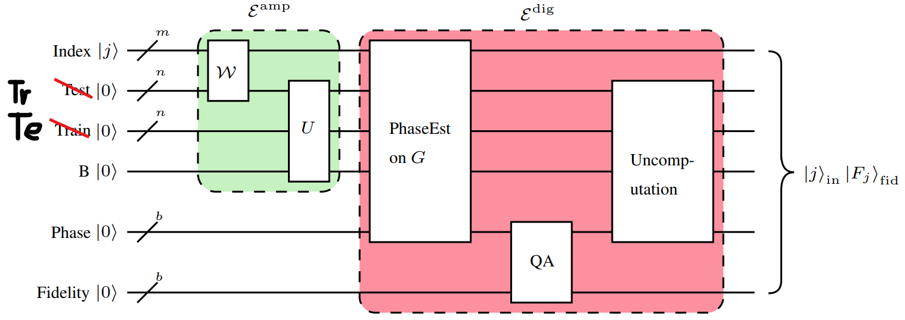
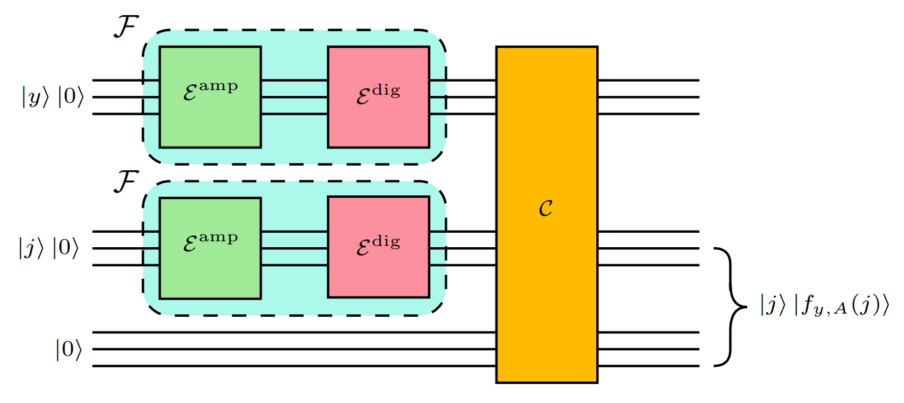

## 论文 《Quantum k nearest neighbors algorithm》 笔记

注：这个算法需要的量子比特很多，不适合大规模数据集（16GB 电脑内存最多才支持 29 个量子）。如果要目前真正能够应用的，还是使用另一个版本的 QKNN，即替换 KNN 算法求距离的那一部分，将经典坐标转换成量子，再求两个量子的内积的平方作为距离，其余的地方依旧使用经典的方法。

### 提取保真度

图中的 Test 寄存器和 Train 寄存器搞反了。

各个量子寄存器说明：

- Index $\ket{j}$：
  m 个比特，存训练样本编号
- Train $\ket{0}$
  n 个比特，训练样本，与编号纠缠
- Test $\ket{0}$
  n 个比特，测试量子态
- B $\ket{0}$
  1 个辅助比特 Swap test 里的控制/测量比特，里面的振幅会含有相似度（保真度）信息。
- Phase $\ket{0}^{\otimes b}$
  b 个比特，用于相位估计，将保真度振幅转换成量子态
- Fidelity $\ket{0}^{\otimes b}$
  b 个比特，最后存放保真度。

各个子电路说明：

- W：制备训练样本，并与编号纠缠
- U：对 Train 和 Test 这两个寄存器进行 Swap test，保真度信息保存在辅助寄存器 B 中
- PhaseEst on G：相位估计
- QA：将 Swap test 的结果通过数学公式转换成真正的保真度，保存在 Fidelity 寄存器中
- Uncomputation：作用逆电路，去除垃圾位

最终得到：$\ket{j}_{in}\ket{F_j}_{fid}$，编号 j 和保真度纠缠的量子态。

接下来就可以使用 Grover 算法求出保真度最高的 k 个量子态对应的编号了。

### Grover 算法求前 k 大的值

得到了各个下标对应的保真度之后，要找出前 k 大的值对应的下标。

核心思路：**先把“找前 k 大”转化成“反复用 Grover 找到更大的元素，不断替换当前候选”**。

假设有一个数组
$$
T = [T_0, T_1, \dots, T_{M-1}]
$$
有 $M$ 个数（在你论文里，后面会把 $T_i$ 换成“保真度”）。

目标：**找到前 $k$ 大的值对应的下标**（indices），也就是 top-k 最大值的索引。

#### 1. 准备工作

随机选出 $k$ 个不同的下标
$$
A = { i_1, i_2, \dots, i_k } \subset {0,1,\dots,M-1}.
$$

更方便加停止条件的版本：选
$$
y = \arg\min_{i \in A} T_i
$$
也就是：使用经典方法遍历 $A$ 中的元素，**选出当前 candidate 里表值最小的那个 index**，把它当作当前“阈值”。

#### 2. 定义 Grover 的“标记函数” $f_{y,A}$

$$
f_{y,A}(j) =
\begin{cases}
1, & \text{如果 } T_j > T_y \text{ 且 } j \notin A, \\
0, & \text{其它情况}.
\end{cases}
$$

* 把这个 $f_{y,A}$ 做成 Grover 的 oracle：

  * 对所有 $j \in {0,\dots,M-1}$ 构成均匀叠加态；
  * 用 oracle 把满足 $f_{y,A}(j)=1$ 的态打上相位（“标记”）；
  * 再用 Grover operator 做若干次迭代。

* 因为我们**不知道满足条件的解有几个**（可能 0 个、也可能很多），就用 Boyer 2005 “解数未知情况下的量子搜索”版本来调节迭代次数。

#### 3. 迭代过程

* 如果量子搜索成功找到某个 $y'$ 满足 $f_{y,A}(y')=1$，那么：

  * 把 $y$ 从集合 $A$ 中删除；
  * 把 $y'$ 加进来；
  * 此时 $A$ 里元素整体变“更大了一点”。

* 如此重复，$A$ 会越来越倾向于包含更大的元素，因为：

  * 每次都用 Grover 搜索找“更大但还没进 A 的元素”，
  * 再把当前候选里“最差的那一个”换出去。

---

#### 4. 停止条件

* 当在再也找不到任何满足
  $$
  T_j > T_y,\quad j \notin A
  $$
  的 index 时，也就是：

* Grover 搜索在布尔函数 $f_{y,A}(j)$ 上**找不到解**了，算法运行结果是均匀叠加态。这就说明已经找到前 k 大的值对应的下标了。

### Grover Oracle 构造

目标 oracle 是：

$$
\mathcal O_{y,A}: \quad |j\rangle|0\rangle ;\longmapsto; |j\rangle|f_{y,A}(j)\rangle
$$

其中

$$
f_{y,A}(j)=
\begin{cases}
1,& F_j > F_y \ \text{且}\ j\notin A,\\
0,& \text{否则}
\end{cases}
$$

也就是说：**给一个索引 (j)**，在辅助比特上打个 1 或 0，表示“这个训练态是不是比阈值 (y) 更接近测试态、而且不在当前解集 A 中”。

图 4 就是把这个 oracle 拆成三块：

1. 上面的 $\mathcal F$：对索引 $y$ 求出 $|F_y\rangle$
2. 下面的 $\mathcal F$：对索引 $j$ 求出 $|F_j\rangle$
3. 黄色的 $\mathcal C$：在经典电路里比较 $F_j$、$F_y$、以及 $j\in A$ 与否，最后输出 $|f_{y,A}(j)\rangle$

右边大括号表示：**在把中间无关寄存器“反计算”掉之后，最终只剩下 $|j\rangle |f_{y,A}(j)\rangle$**，这就是 Grover 需要的 oracle 形式。

图中的 $\mathcal C$ 是一串**可逆经典电路**（全是 Toffoli、X 等门），它接收：

* 上路：$|y\rangle|F_y\rangle$
* 下路：$|j\rangle|F_j\rangle$
* 以及若干辅助比特（图底下那条 $|0\rangle$ 线其实就是这些 ancilla 的集合）

内部做三件事：

1. **比较 $F_j$ 和 $F_y$**

   * 用比较门 $J$：如果 $F_j>F_y$，就把某个 ancilla 比特翻成 1，得到一个布尔量 $g(j)$。

2. **检测 j 是否在集合 A 中**

   * 利用很多门 $D^{(i_\ell)}$，检查“j 等不等于 $A$ 里的每一个索引”，从而构造出指示函数 $\chi_A(j)$（在某个 ancilla 上）。

3. **组合成最终的 $f_{y,A}(j)$**

   * 根据定义：$f_{y,A}(j)=1$ 当且仅当 $g(j)=1$ 且 $\chi_A(j)=0$。
   * 于是通过 X+Toffoli 等逻辑组合，把这两个布尔量合并到最后的一个 ancilla 上，这个最后的 ancilla 就是 $|f_{y,A}(j)\rangle$。

然后，$\mathcal C$ 还会把“用完的中间 ancilla”和“上面的 $|y\rangle|F_y\rangle$”都一步步反计算掉（图的文字解释里说 explicit 版本中会插一个 $\mathcal F$ 的 uncomputation，这里省略了）。

使用这个时候使用 Grover 算法就能够求出前 k 大的保真度对应的下标，然后使用经典方法记录投票结果，得到最终分类结果。